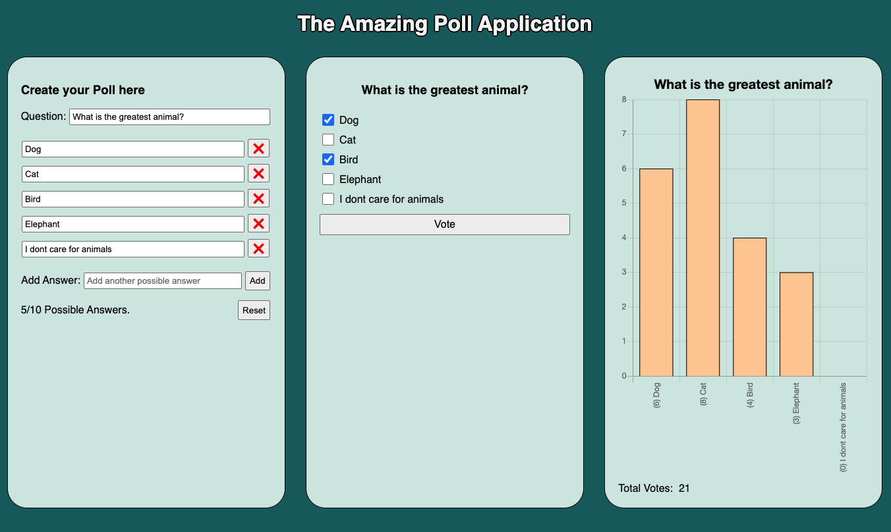

# Poll SPA

## Description
My take on a simple poll application which works exclusively in the frontend in React.js.

The app is divided in three sections:
* On the first section, the user can create a poll with up to 10 options. 
* In the central one, the user can vote by selecting one (or several) of the options and pressing the "vote" button. 
* On the final section, the chart will update based on the questions created and the votes that each question got.

## Live Demo
You can find a live demo [Here](https://the-amazing-poll-app.netlify.app/)

## Preview
